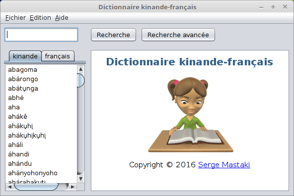

# Dictionnaire kinande-francais

Ce dictionnaire est la première version officielle du dictionnaire kinande-français basé sur le [dictionnaire kinande-français](http://www.google.cd/url?q=http://www.africamuseum.be/museum/research/publications/rmca/online/online-kinande.pdf) du professeur __Philippe Mutaka__. Ce logiciel a pour but de promouvoir la culture nande au travers de sa langue.

## Captures d'écran

